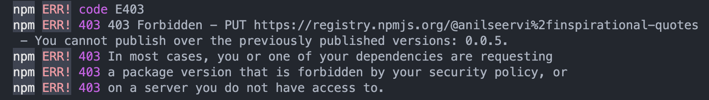

import { Link } from "gatsby"

Recently when I published my last article on <Link to="/blog/reduce-arrays-like-a-pro/">`reduce()`</Link>, I faced this issue while publishing an update to my _npm package_ [`@anilseervi/inspiratinal-quotes`](https://www.npmjs.com/package/@anilseervi/inspirational-quotes).

`@anilseervi/inspirational-quotes` is an _npm_ package that I created for this blog site. It returns a random `quote`(with it's `author`) that you can see at the end of any article on this blog site.

While publishing a patch update to this package I noticed the following error message :

I wasn't able to find a proper solution to this problem.

This basically means that the version(defined in `package.json`) you are pushing has already been pushed to the registry and you cannot publish over it.
Even if you don't see the version you are pushing in the NPM's UI, `npm publish` would error out because you might have already pushed the same version to the registry but it was not published(public/private) due to some underlying errors.

Previously it was possible for one to un-publish a specific version and publish a new onto the same version. But now even if you un-publish a version, you won't be able to push a new update onto the same version. This doesn't mean that you should keep on bumping versions till you successfully publish your package.

## Find the version you can publish

Here's what you can do to find what the version you can publish :

1. Go to `https://registry.npmjs.org/(your_package_name)`
2. In the JSON file, check for the `time` property which is an object with key value pairs of `version` and its `date` published to the registry.
3. Find the _latest version_ that is available on the registry.
4. Publish the version that is not on the registry :D

> It will be easier to find the version if you open the link in the FireFox browser.

## Steps to publish the package

1. Bump the version of your package using `npm version <version>`.
2. Login to npm registry using `npm login`.
3. Publish to npm registry using `npm publish`.
