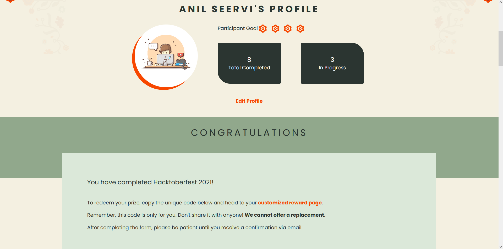
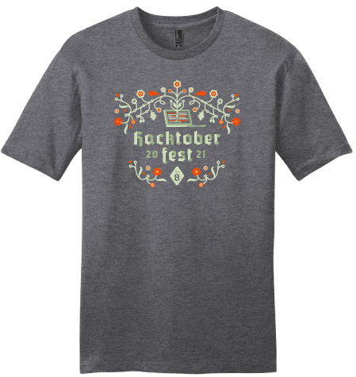

Hello 👋🏽 to Everyone reading this.

I'm so excited to tell the journey of my first [**Hacktoberfest**](https://hacktoberfest.digitalocean.com) Event.

## Backstory

It all started before the month of hacktoberfest when I came across a post in _dev.to_ which showcased winning swag by contributing to _Open-Source_. I love contributing to Open-Source and I straight away checked the official website and waited for the registration to start. As I was earlier to this before the start of month October, I registered right away when the registrations opened.

I came to know that last year was disastrous for some repo maintainers because of the spam they had to deal with. So as I went through the rules for participating in this year's event and it was obvious that organizers would make it more strict this time to avoid any spam.

## Main Event

My first PR to count towards the event was : [kimlimjustin/xplorer#108](https://github.com/kimlimjustin/xplorer/pull/108) which was on 1st Oct.
I was already contributing to the [kimlimjustin/xplorer](https://github.com/kimlimjustin/xplorer) repo(_which btw is a well-designed cross-platform file-explorer you might wanna check out!_) before the hacktoberfest kicked-off and as this is my first event I didn't know how the PR's were counted and all.

It was only when I checked the official website for any update I came to know that a PR had already been counted towards the event and the repo I submitted to was participating in the event.😅

Seeing that already 1 out of 4 PR was already done, I was on a rampage to find more repos tagged with the `hacktoberfest` labels to contribute to.

## Contributions

Here's the list of the PR's that I submitted, counted towards the event :

- [kimlimjustin/xplorer#108](https://github.com/kimlimjustin/xplorer/pull/108)
- [mui-org/material-u#28762](https://github.com/mui-org/material-ui/pull/28762)
- [mui-org/material-u#28751](https://github.com/mui-org/material-ui/pull/28751)
- [kimlimjustin/xplorer#121](https://github.com/kimlimjustin/xplorer/pull/121)
- [kimlimjustin/xplorer#124](https://github.com/kimlimjustin/xplorer/pull/124)
- [kimlimjustin/xplorer#117](https://github.com/kimlimjustin/xplorer/pull/117)
- [kimlimjustin/xplorer#128](https://github.com/kimlimjustin/xplorer/pull/128)
- [zero-to-mastery/resources#736](https://github.com/zero-to-mastery/resources/pull/736)
- [kimlimjustin/xplorer#143](https://github.com/kimlimjustin/xplorer/pull/143)
- [Sangwan5688/BlackHole#125](https://github.com/Sangwan5688/BlackHole/pull/125)
- [github/docs#11120](https://github.com/github/docs/pull/11120)
- [kimlimjustin/xplorer#165](https://github.com/kimlimjustin/xplorer/pull/165)
- [github/docs#11328](https://github.com/github/docs/pull/11328)
- [github/docs#11295](https://github.com/github/docs/pull/11295)
- [github/docs#11234](https://github.com/github/docs/pull/11234)

If you'll look at all the PR's I've made during this time, you'll notice that all of them are minor yet notable changes and these contributions meet the criteria for being counted towards the hacktoberfest event.

I'm also a newbie to Open-source and have only been able to make minor doc changes for this time's event. I'm starting to get the hang of it now by actually interacting with maintainers and other contributors. It's such a welcoming community who guide beginners with such patience.

## Results

As the minimun PRs required to win some swag is 4, mine were only waiting for the review period of 14 days to complete.

This time [official event swag](https://hacktoberfestswaglist.com/#swag-list-2021) include:

- T-Shirts
- Stickers
- [Dev.to badge](https://shop.dev.to/products/dev-hacktoberfest-badge)

These rewards can be claimed after 4 of you're PRs have successfully passed the review.

Thank you for reading this article.
And Congrats if you've also won this time hacktoberfest event.🎉🎉

## Update

I've recieved the [dev.to](https://dev.to/anilseervi) Hacktoberfest 2021 badge and it can be seen on my profile.

Also the Hacktoberfest swag arrived : [Twitter](https://twitter.com/linASeervi/status/1495396409264472064)
